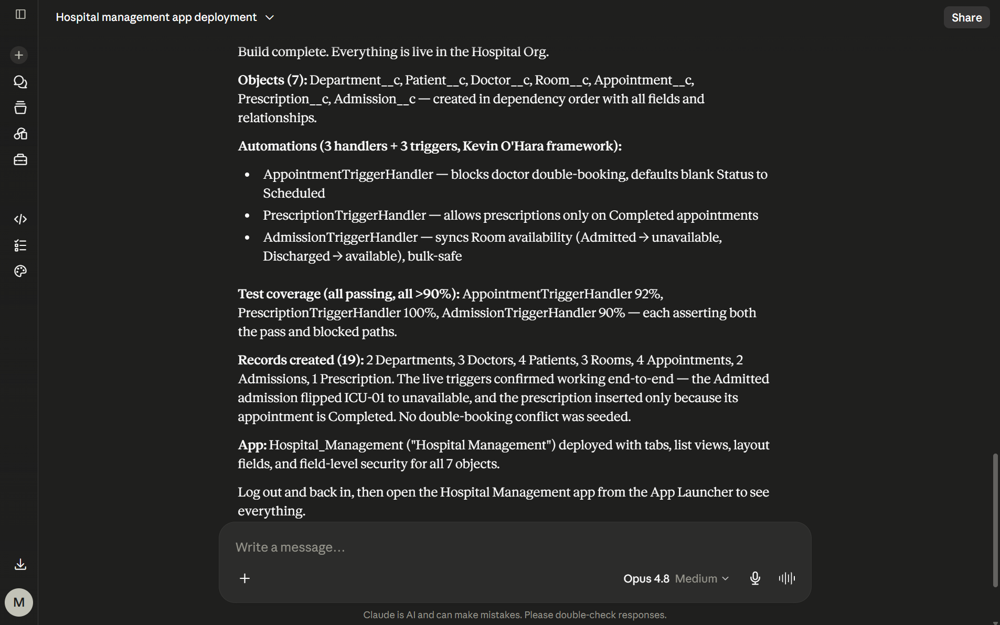
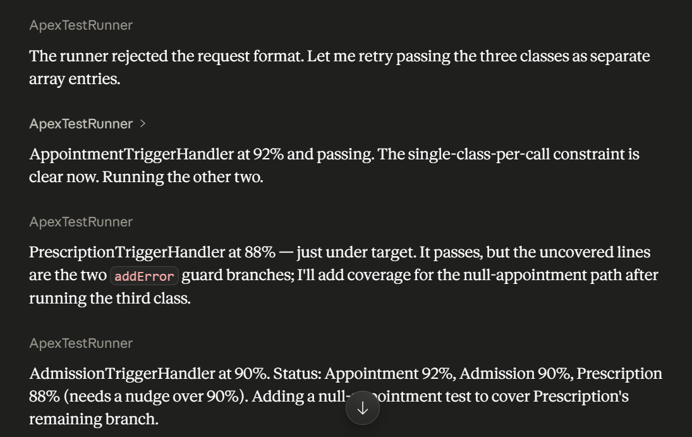
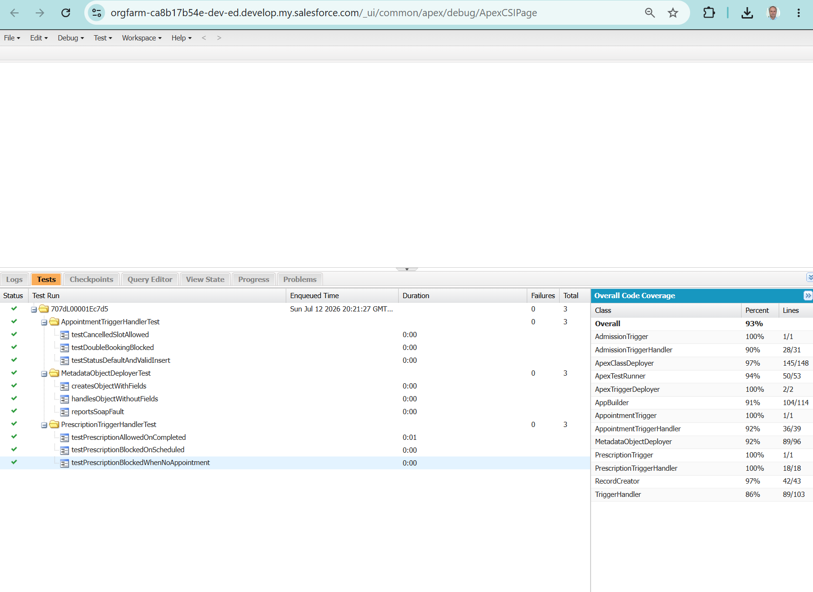
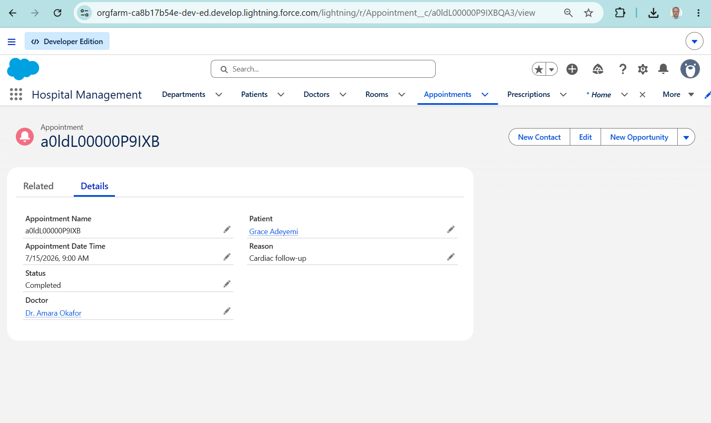
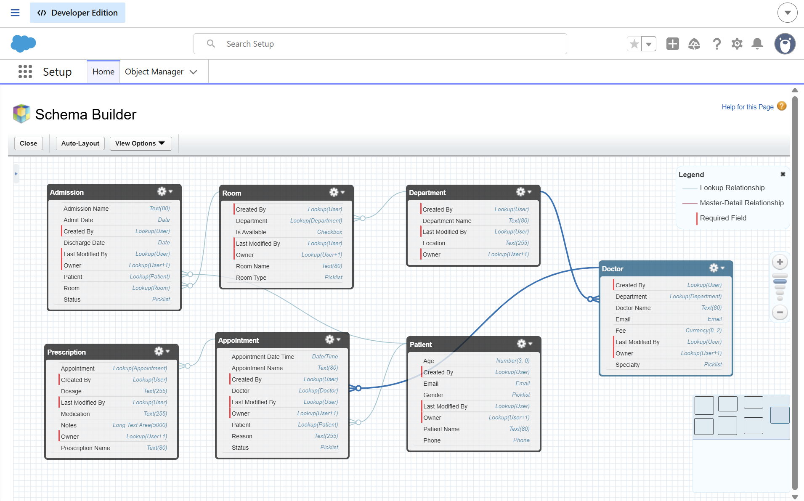

# Hospital Org — a Salesforce org built by an AI agent loop

**This repository is the source of a complete hospital-management Salesforce org that was
not written by hand.** It was built by a single agentic loop I designed: Claude deploys,
tests, reads the failures, fixes, and repeats until everything is green — through **six
custom MCP deployment tools**, with **ApexTestRunner as the verifier**.

> **Honest framing.** This is a reference implementation built on my own initiative, not
> client work. The loop, the six MCP tools, the deployed metadata, the tests and the
> coverage numbers are real — this repo is the retrieved source of what the loop built in a
> live Developer Edition org. The domain (a hospital) is fictional demo data.
>
> Full case study: **[mustafaaksu.dev/en/projects/hospital-org-agentic-build](https://mustafaaksu.dev/en/projects/hospital-org-agentic-build)**
> · Video (one prompt → the whole org): **[youtu.be/rbCg6onS5co](https://youtu.be/rbCg6onS5co)**

---

## The idea in one paragraph

By 2026 the interesting question is no longer *"can a model write an Apex class?"* — it can.
The question is **loop engineering**: can you design a reliable, verifiable cycle that lets
an agent do multi-step platform work — governor limits, metadata dependencies, deployment
order — without a human typing each step, and with a verification mechanism strong enough to
trust the result? A loop without a real verifier is just an expensive way to generate
plausible-looking code. Here, the verifier is **ApexTestRunner**: the loop's stop condition
is objective — *all tests green at ≥ 90 % coverage*. The agent doesn't grade itself "done";
the test runner does.



---

## What the loop built (this repo's contents)

| Layer | Components |
|---|---|
| **Data model** | 7 custom objects — `Department__c`, `Patient__c`, `Doctor__c`, `Room__c`, `Appointment__c`, `Prescription__c`, `Admission__c` — deployed in strict dependency order (parents first; returned record Ids reused for seed data) |
| **Automation** | 3 triggers + 3 handlers on the Kevin O'Hara `TriggerHandler` framework: double-booking blocked, prescriptions only on *Completed* appointments, room availability synced on admission/discharge |
| **Tests** | 3 handler test classes, final coverage **92 / 100 / 90 %** — plus the framework's own test |
| **App** | The `Hospital_Management` Lightning app: tabs, list views, layouts for all seven objects |
| **The agent's hands** | The six MCP tools themselves, as Apex: `MetadataObjectDeployer`, `ApexClassDeployer`, `ApexTriggerDeployer`, `ApexTestRunner`, `RecordCreator`, `AppBuilder` — each with its own test class |

The six tools are exposed to Claude over **Salesforce Hosted MCP Servers** (an External
Client App + an MCP server definition), so every call runs in the org's own security
context, as an authenticated user, fully audited.

---

## The loop, as it actually ran

```
deploy metadata ─► deploy Apex ─► run tests ─► read the ACTUAL failures ─► fix ─► repeat
        (dependency order)            │
                                      └─ stop condition: all green at ≥ 90 % coverage
```

Two moments from the real run are worth more than any diagram:

**1. The verifier said no — and the loop listened.** `PrescriptionTriggerHandler` came back
at **88 %**, under the 90 % target. The loop did not declare success. It read *which* lines
were uncovered (the two `addError` guard branches), wrote a null-appointment test for the
missing path, and re-ran to green.



**2. Diagnosis instead of blind retries.** When a deploy threw an opaque script-exception,
the loop enumerated root causes (object already exists? integration-user permissions? an
in-flight deploy?) instead of hammering the same failing call — and when the test runner
rejected a malformed request, it diagnosed the single-class-per-call constraint and adapted.

Independent proof, inside the org rather than the chat — 9/9 tests green at 93 % overall
coverage, with the six MCP tools visible in the coverage panel as tested Apex classes:



And the result in use — the app the loop shipped, on a real seeded appointment
(the record name is the raw Id: the loop built this; no human polished it afterwards):




---

## Repository layout

```
hospital-org-mcp/
├── README.md
├── docs/images/          The five proof screenshots referenced above.
├── manifest/package.xml  Exactly what was retrieved from the org.
└── force-app/main/default/
    ├── applications/     Hospital_Management app
    ├── classes/          3 trigger handlers + tests, TriggerHandler framework + test,
    │                     and the six MCP deployment tools + tests
    ├── triggers/         AppointmentTrigger, PrescriptionTrigger, AdmissionTrigger
    └── objects/          the 7 custom objects (fields, list views)
```

## Deploy it yourself

```bash
sf project deploy start --manifest manifest/package.xml -o <your-org>
sf apex run test -o <your-org> --code-coverage --wait 10
```

Apex tests are free — they spend no Flex Credits.

---

## Documentation

| Document | What it answers |
|---|---|
| [ARCHITECTURE.md](ARCHITECTURE.md) | Source layout + the six rules that shaped it |
| [docs/adr/](docs/adr/) | **6 Architecture Decision Records** — the loop design as explicit decisions: verifier over self-assessment, six narrow tools, tested hands, dependency order, archive-the-retrieved-source, the trigger framework |
| [docs/architecture/](docs/architecture/) | Mermaid views: context, container, the loop as a sequence (with its two teachable failures), and the measured 7-object lookup graph |
| [CONTRIBUTING.md](CONTRIBUTING.md) | The standing rule: loop-first, retrieve-after — why hand-editing `force-app/` would destroy the exhibit |
| [SECURITY.md](SECURITY.md) | What it means to give an agent deployment power, and how it was bounded |
| [CLAUDE.md](CLAUDE.md) | Working context for the next session (human or AI) |

## Related projects

- **[Prüfstand](https://mustafaaksu.dev/en/projects/pruefstand)** — the test bench that
  red-teams an Agentforce agent (deterministic verifier, pre-registered German attack corpus).
- **[Agent Blast Radius](https://mustafaaksu.dev/en/projects/agent-blast-radius)** — the
  static analyzer that computes what an agent's code can *actually* reach, beyond its user.
- **[MCP, end to end](https://mustafaaksu.dev/en/mcp)** — the 24-minute walkthrough of
  connecting Claude to Salesforce over Hosted MCP Servers.

---

*Author: **Mustafa Aksu** — Salesforce Developer & ISV Partner (Agentforce · MCP · Data 360).
Portfolio: [mustafaaksu.dev](https://mustafaaksu.dev) · Licensed MIT.*
