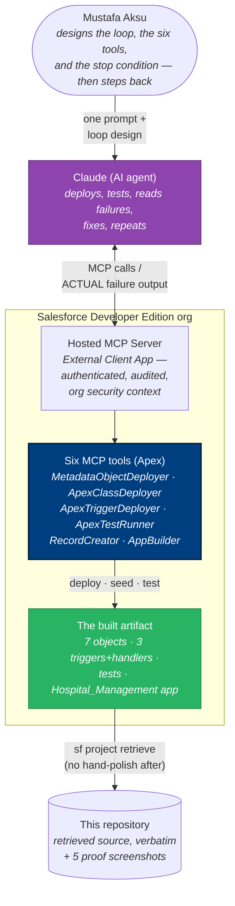

# 01 — System Context (C4 Level 1)

## Purpose

Who and what took part in the build: the human designs the loop, the agent
runs it, the org verifies it. The boundary worth noticing is that **all
capability lives inside the org** — there is no credentialed middle layer.

## Diagram

## Key observations

1. **The human's contribution is the loop, not the code** — the design of
   the hands (ADR-002), the ground truth (ADR-001), and the exit criterion
   (≥ 90% coverage, all green).
2. **No credentials outside the org**: Claude reaches the tools through a
   Hosted MCP Server; every call executes as an authenticated user under
   the org's own audit (ADR-003).
3. **The verifier is inside the boundary it verifies** — ApexTestRunner is
   org-resident, tested Apex, and its word (not the agent's) ends the loop.
4. **The repo is downstream of the org**, never the other way: what is
   published is what was retrieved (ADR-005).

## Drill-down

Inside the boundary: [02 — Container](02-container.md).
