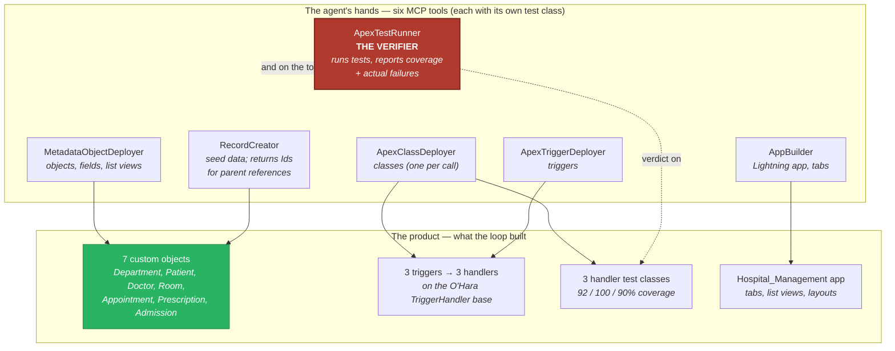

# 02 — Container Diagram (C4 Level 2)

## Purpose

The two populations of Apex in this org — the **tools** (the agent's hands)
and the **product** (what the hands built) — and the rule that both are
held to the same testing bar.

## Diagram

## Rules that shaped this picture

| Rule | Consequence | ADR |
|---|---|---|
| Verifier ends the loop, not the agent | ATR's report (incl. the 88% no) is the only exit | 001 |
| One tool per intent | six named capabilities, nothing general-purpose | 002 |
| Hands are tested like product | every `*Deployer`/`Runner`/`Creator`/`Builder` has a `*Test` | 003 |
| Parents before children | deploy/seed order follows the lookup graph | 004 |
| Trigger logic in handlers | triggers are thin dispatchers on the vendored base | 006 |

## Drill-down

- The loop in time order, with its two teachable failures: [03 — Sequence](03-sequence.md)
- The 7-object lookup graph, measured from source: [04 — Data Model](04-data-model.md)
