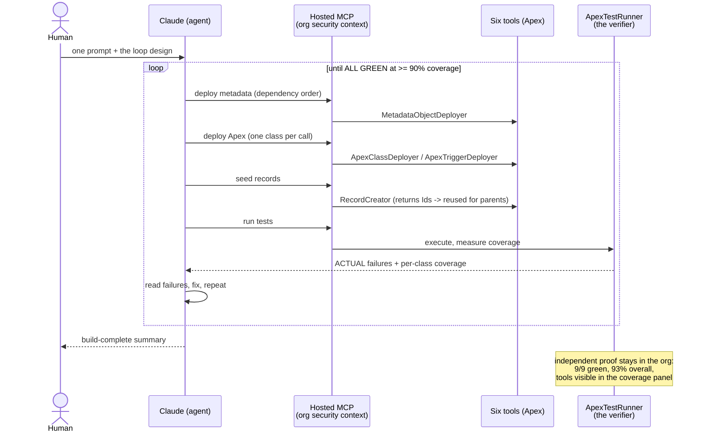

# 03 — Sequence: the loop, as it actually ran

## Purpose

One cycle of the build loop, plus the two recorded moments that show why
the design holds: the verifier saying no, and diagnosis beating retries.

## Diagram

## The two recorded moments

**1. The verifier said no — and the loop listened.**
`PrescriptionTriggerHandler` returned **88%**, under the 90% target. No
self-granted success: the loop read *which* lines were uncovered (the two
`addError` guard branches), wrote a null-appointment test for exactly that
path, re-ran, went green. (`docs/images/loop-verifier.png`)

**2. Diagnosis instead of blind retries.**
An opaque script-exception on deploy → the loop enumerated root causes
(object already exists? integration-user permissions? in-flight deploy?)
rather than hammering the same call. A malformed test request → it
diagnosed the single-class-per-call constraint and adapted its batching.

## Why the sequence is trustworthy

The exit condition is produced by org-resident, tested code (ADR-003) and
is independently checkable after the fact: deploy this repo's manifest,
run the tests, compare against `docs/images/tests-green.png`.
