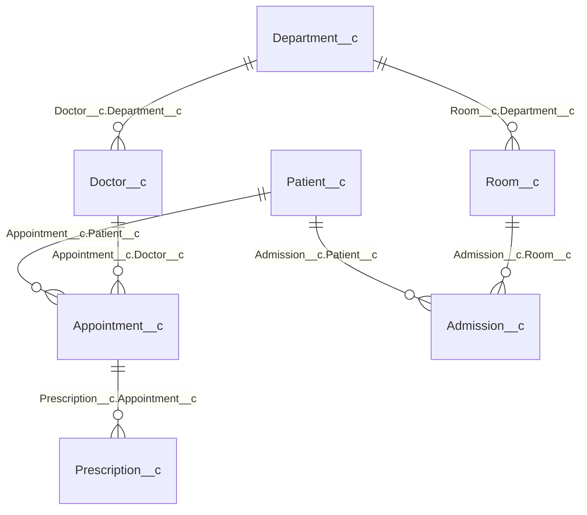

# 04 — Data Model: the 7-object lookup graph

## Purpose

The deployed schema, **measured from the retrieved source** (every edge
below is a `<type>Lookup</type>` field in
`force-app/main/default/objects/*/fields/`), not redrawn from memory. This
graph is also the deploy order (ADR-004): parents before children.

## Diagram



All seven relationships are **Lookups** (no master-detail): the loop chose
the loosest coupling the automation allows, and enforces the business rules
in handlers instead of in schema (see below).

## Deploy order implied by the graph

```
1. Department__c                      (no parents)
2. Patient__c                         (no parents)
3. Doctor__c, Room__c                 (need Department__c)
4. Appointment__c                     (needs Patient__c + Doctor__c)
5. Prescription__c                    (needs Appointment__c)
   Admission__c                       (needs Patient__c + Room__c)
```

Seed data follows the same order, reusing the Ids `RecordCreator` returned
for each parent (ADR-004).

## Where the business rules live

The schema stays permissive; the invariants are trigger-enforced
(ADR-006):

| Rule | Enforced by |
|---|---|
| No double-booking (same doctor, overlapping slot) | `AppointmentTriggerHandler` |
| Prescriptions only on **Completed** appointments | `PrescriptionTriggerHandler` |
| Room availability synced on admission/discharge | `AdmissionTriggerHandler` |

Each handler has a dedicated test class; the coverage story (92/100/90%,
including the 88%→green correction) is told in
[03 — Sequence](03-sequence.md) and ADR-001.
